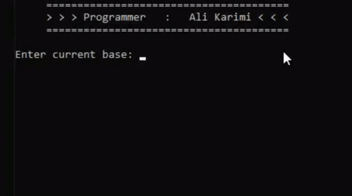

<html>
<body>
<h1 align='center'>Converting-the-base-of-integers-from-any-base-to-any-other-integer-base</h1>
<h2 align='center'>تبدیل پایه (مبنا) اعداد صحیح از هر پایه (مبنا) به هر پایه (مبنا) اعداد صحیح دیگر</h2>

     <h3 align='left'>Project Language: C</h3>
</body>
</html>
